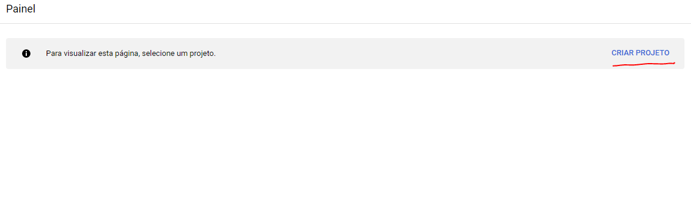
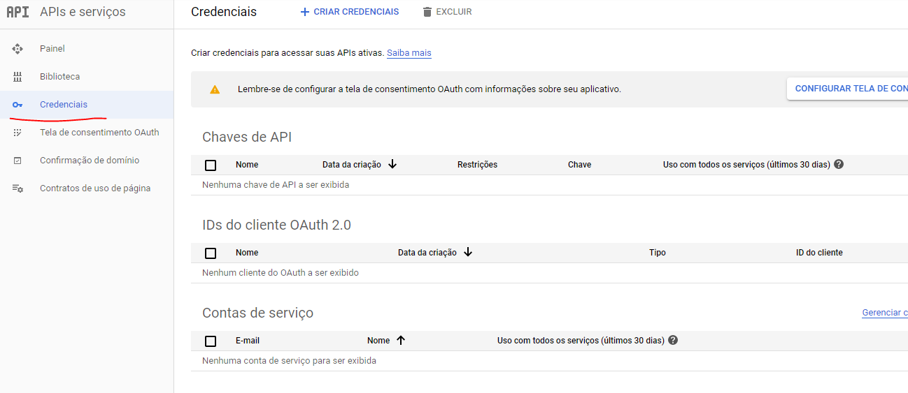
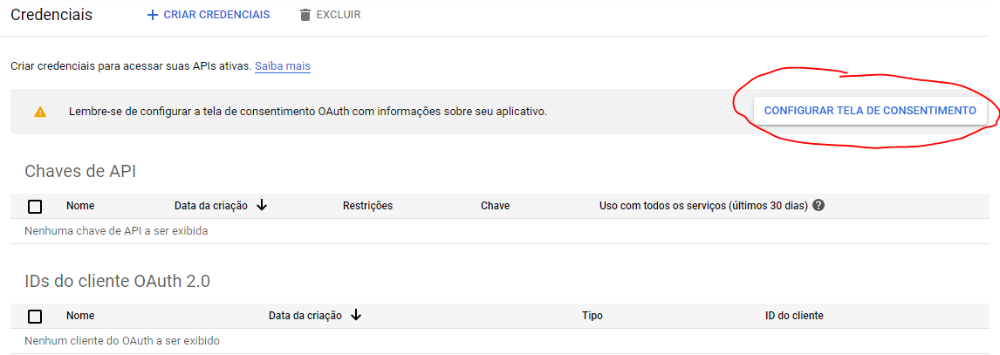
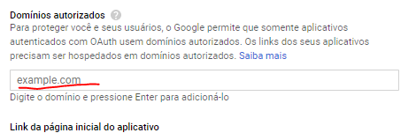
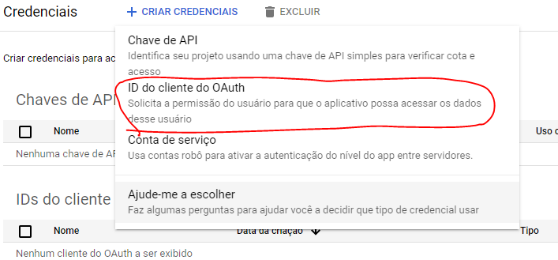
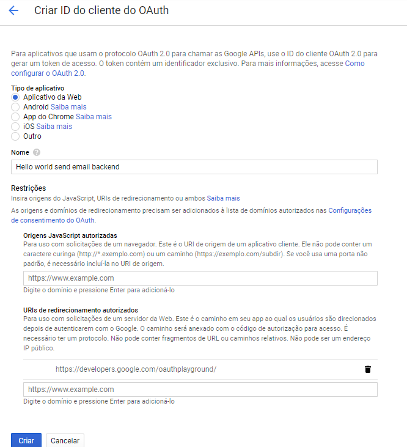
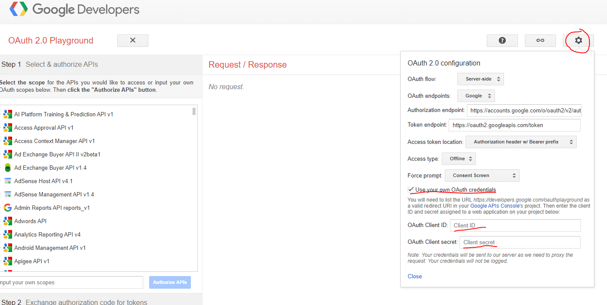
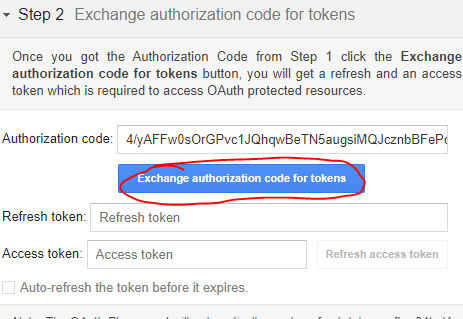

## Enviando e-mail com nodemailer e gmail utilizando OAuth2

A seguir você verá o passo a passo para criar uma feature de envio de e-mail utilizando nodemailer e gmail com OAuth2

### 1. Criando o e-mail

O primeiro passo é criar um novo endereço de e-mail pessoal que será utilizado para fazer o envio dos nossos e-mails. Para isso, acesse o [Gmail](https://mail.google.com).

### 2. Criando o projeto no Google Cloud

Para criar seu projeto no [Google Cloud](https://console.developers.google.com), clique em criar novo projeto e preencha o formulário mostrado.

* Criando projeto

### 3. Criando credenciais

Acesse o item **Credenciais** no menu a direita e configure **Tela de consentimento**.

* Menu credenciais

* Tela de consentimento

Informe o nome do seu aplicativo e adicione o domínio autorizado a fazer requisições para seu projeto do Console Google.

Clique em salvar.

* Criando ID do cliente OAuth

Volte ao menu **Credenciais** e clique em acesso a página para criar um novo ID do cliente OAuth.

Selecione **Aplicativo da web**, preencha o formulário mostrado com o nome da sua aplicação, e informe as URIs de redirecionamento autorizadas. Dentre elas informe o endereço: *https://developers.google.com/oauthplayground* e a URL onde está hospedada a sua aplicação que irá fazer a requisição para o projeto do console google. E clique em **Criar**.

Copie as chaves ID do cliente e chave secreta do cliente mostradas e substitua no seu arquivo *.env* deste projeto.

### 4. Pegando Refresh Token

Acesse o [Google Developers Playground](https://developers.google.com/oauthplayground/) e clique no ícone de configurações. 

Selecione a opção *Use your own OAuth credentials* e preencha com os seus tokens.

Após preencher com seus tokens, adicione o escopo *https://mail.google.com/*. Faça login com sua conta de e-mail e permita as solicitações feitas pelo console do google.
Clique em *Exchange authorization for tokens* e copie o Refresh token gerado.

Copie o refresh token gerado e substitua no arquivo .env deste projeto.

### Testando a API

Para testar a API, siga a tabela abaixo contendo as requisições disponíveis.

| URL           | Method        | Body            |
|:------------- |:--------------|:----------------|
| /send_email   | POST          | *email: string* |